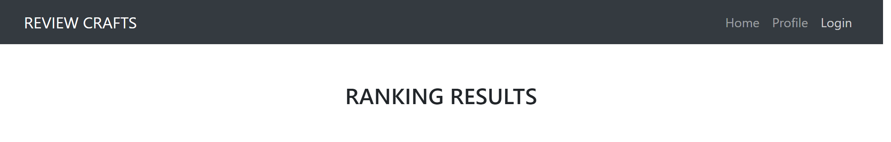

# Review-Crafts

## Description:
A user interactive website to rate and view breweries in the state of Wisconsin. 

Built With:
* Pug
* CSS 
* Javascript
* Express
* Sequelize
* Bcrypt
* Auth0

## Table of Contents
* [Installation](#installation)
* [Usage](#usage)
* [Credits](#credits)

## Installation
1. Install the following npm packages:
* sequelize
* mysql
* pug
* axios
* bcrypt
* dotenv
* express
* express-openid-connect
* express-session
* node-fetch
* path
* jquery
* auth0

2. Required dotenv file variables:
* DB_User 
* DB_PW 
* DB_Name
* DEV_PORT
* PROD_PORT
* AUTH0_ISSUER_BASE_URL
* AUTH0_CLIENT_ID
* BASE_URL
* SESSION_SECRET
* CLIENT_SECRET

3. Create a mysql database and table

## Usage

Users can create a profile for complete functionality of the website after logging in.

&nbsp;

User searches for a city within the state of Wisconsin to pull back to list of breweries within that city.

 

&nbsp;

After the user has created a profile and has successfully searched for a city, the user can being submitting reviews for breweries that they visit. 

&nbsp;

## Credits
* Adam Olson - https://github.com/adamlsn
* Devon Ross - https://github.com/dr-50
* Kaan Nazlioz - https://github.com/nazliozemrek
* Mitchell Spierings - https://github.com/mspierings96

## Website:
Github Repo - 
https://github.com/mspierings96/Craft-Reviews

Live Site - 
https://review-crafts.herokuapp.com/
